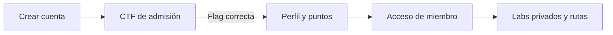

# ShadowBytes

Plataforma de aprendizaje para el grupo de estudio de ciberseguridad. Aquí una persona puede crear su cuenta, resolver el CTF de admisión, guardar sus avances y, al convertirse en miembro, acceder a laboratorios privados.

## Para empezar

1. Instala dependencias: `pnpm install`.
2. Copia `.env.example` como `.env.local`.
3. Añade la URL de Supabase y su **Publishable key**. Estas dos variables empiezan con `VITE_` porque se usan en el navegador.
4. Inicia el proyecto: `pnpm dev`.
5. Abre la URL que muestre Vite y sigue **Admisión**.

```env
VITE_SUPABASE_URL=https://TU_PROYECTO.supabase.co
VITE_SUPABASE_PUBLISHABLE_KEY=sb_publishable_...
```

> [!WARNING]
> Nunca uses una clave `service_role` ni una `sb_secret_` en el frontend, `.env.local`, Git o Vercel. La clave publishable está pensada para el navegador; la seguridad se implementa con RLS y funciones SQL.

## Recorrido para estudiantes



- **Admisión:** explica el proceso y presenta el reto de entrada.
- **Labs:** reúne los retos publicados y permite filtrar por tema y dificultad.
- **Rutas:** ordena teoría y práctica para saber qué hacer a continuación.
- **Perfil:** muestra puntos, retos resueltos y el avance hacia el siguiente rango.

## Base de datos y progreso

La configuración se divide en dos scripts para que una instalación nueva quede segura desde el inicio:

1. Ejecuta [`supabase/schema.sql`](./supabase/schema.sql) en el SQL Editor de Supabase.
2. Ejecuta [`supabase/migrations/20260831_secure_ctf_admission.sql`](./supabase/migrations/20260831_secure_ctf_admission.sql).
3. Ejecuta [`supabase/migrations/20260904_guided_learning_mvp.sql`](./supabase/migrations/20260904_guided_learning_mvp.sql) para activar pasos guiados, pistas progresivas, rate limiting y Storage privado.
4. Sigue la guía de operación en [`supabase/README.md`](./supabase/README.md) para promover al primer administrador y publicar el CTF de admisión.

El segundo script mueve flags y writeups a una tabla privada, valida respuestas desde una función SQL y guarda cada solve junto con sus puntos. El navegador nunca recibe flags reales.

## Vercel

En el proyecto `proyecto-estudio` deben existir estas variables de tipo **Config** para Production, Preview y Development:

- `VITE_SUPABASE_URL`
- `VITE_SUPABASE_PUBLISHABLE_KEY`

Cada despliegue nuevo leerá esas variables. Si cambias una variable, crea un despliegue nuevo para que Vite la incorpore durante la compilación.

## Comandos útiles

```bash
pnpm dev        # desarrollo local
pnpm typecheck  # verificación TypeScript
pnpm test       # contratos de seguridad y rutas
pnpm build      # compilación de producción
pnpm preview    # previsualizar la compilación generada
```

## Estructura del proyecto

- `src/pages`: pantallas de la plataforma.
- `src/components`: bloques reutilizables de la interfaz.
- `src/context/AuthContext.tsx`: sesión, perfil y acreditación del progreso.
- `src/hooks`: carga de retos y detalle de cada lab.
- `supabase`: esquema, migraciones y guía de operación.
- `docs`: guías pensadas para estudiantes y colaboradores.

## Antes de publicar cambios

1. Ejecuta `pnpm typecheck`, `pnpm test` y `pnpm build`.
2. Prueba registro, inicio de sesión, admisión y envío de flag.
3. Comprueba que un estudiante no puede ver flags ni writeups antes de resolver el reto.
4. Revisa que las variables de Vercel estén configuradas y crea un nuevo despliegue.

Los fixtures solo se habilitan en desarrollo con `VITE_ENABLE_DEMO_DATA=true`. En producción, una configuración o conexión fallida muestra un error real y no sustituye información de ejemplo.
